# Swift Trainer API 🚀

基于 FastAPI 的 Swift 训练任务管理 API 系统，支持多 GPU 训练、Redis 状态管理、GPU自动排队功能、模型部署管理和详细日志记录。

[](https://www.python.org/downloads/)
[](https://fastapi.tiangolo.com/)
[](https://redis.io/)
[](https://github.com/modelscope/swift)
[](https://www.docker.com/)
[](https://developer.nvidia.com/cuda-toolkit)
[](LICENSE)

## 📋 目录

- [✨ 主要特性](#-主要特性)
- [🏛️ 系统架构](#-系统架构)
- [🏗️ 项目结构](#-项目结构)
- [🎯 GPU排队功能](#-gpu排队功能)
- [🧩 多任务类型训练支持](#-多任务类型训练支持)
- [🚀 模型部署功能](#-模型部署功能)
- [⚡ 快速开始](#-快速开始)
- [💡 使用示例](#-使用示例)
- [📚 API文档](#-api文档)
- [⚙️ 配置说明](#-配置说明)
- [🎯 优先级使用指南](#-优先级使用指南)
- [🔧 开发指南](#-开发指南)
- [🔍 故障排除](#-故障排除)
- [📊 监控和日志](#-监控和日志)

## ✨ 主要特性

- 🚀 **Swift训练任务管理**: 完整的训练任务生命周期管理
- 🎯 **GPU自动排队**: 智能GPU资源分配和排队机制
- 🔄 **优先级管理**: 支持任务优先级设置（0-10）
- 🚀 **模型部署管理**: 智能端口分配和部署生命周期管理
- 📊 **实时监控**: 训练进度、GPU状态、系统资源监控
- 💾 **Redis存储**: 持久化任务状态和训练数据
- 📝 **详细日志**: 完整的训练日志和事件记录
- 🐳 **Docker支持**: 一键部署和容器化运行
- 🔧 **RESTful API**: 标准化的API接口设计
- 🔀 **多任务类型**: 支持多模态、语言模型和部署任务

## 🏛️ 系统架构

```mermaid
graph TD
    A[FastAPI Server] --> B[Training Service]
    A --> C[Deploy Service]
    A --> D[Redis Service]
    
    B --> E[GPU Manager]
    B --> F[Training Handler]
    B --> G[Queue Processor]
    
    C --> H[Port Allocator]
    C --> I[Deploy Handler]
    C --> J[Deploy Queue]
    
    D --> K[(Redis DB)]
    E --> L[NVIDIA GPUs]
    
    subgraph "训练流程"
        M[创建训练任务] --> N[GPU分配]
        N --> O{GPU可用?}
        O -->|是| P[直接启动]
        O -->|否| Q[加入队列]
        Q --> R[等待GPU] --> P
    end
    
    subgraph "部署流程"  
        S[创建部署任务] --> T[端口分配]
        T --> U[资源检查]
        U --> V[启动服务]
    end
```



## 🏗️ 项目结构

```
swift-api/
├── application/              # 主应用目录
│   ├── __init__.py
│   ├── main.py              # FastAPI应用入口
│   ├── setting.py           # 配置管理
│   ├── models/              # 数据模型
│   │   ├── __init__.py
│   │   ├── base_trainer.py  # 训练器基类架构
│   │   ├── training_model.py # 训练任务模型
│   │   └── deploy_model.py  # 部署任务模型
│   ├── services/            # 业务逻辑
│   │   ├── __init__.py
│   │   ├── training_service.py   # 训练服务
│   │   ├── training_handler.py   # 训练处理器
│   │   ├── deploy_service.py     # 部署服务
│   │   ├── deploy_handler.py     # 部署处理器
│   │   ├── port_allocator.py     # 端口分配器
│   │   └── redis_service.py      # Redis服务
│   ├── api/                 # API路由
│   │   ├── __init__.py
│   │   ├── training.py      # 训练相关API (v1)
│   │   ├── training_v2.py   # 训练相关API (v2)
│   │   └── deploy.py        # 部署相关API
│   └── utils/               # 工具函数
│       ├── __init__.py
│       ├── logger.py        # 日志工具
│       └── gpu_utils.py     # GPU工具
├── env/                     # 环境配置文件
├── install_all.sh          # Swift环境安装脚本
├── start.py                # 启动脚本
├── docker-compose.yml      # Docker编排配置
├── Dockerfile              # Docker镜像配置
├── test_integration.py     # 集成测试
└── test_refactor.py        # 重构测试
```

## 🎯 GPU排队功能

### 核心特性

1. **自动GPU分配**: 无需手动指定GPU ID，系统自动选择最优GPU
2. **智能排队**: 当GPU不可用时，任务自动加入队列等待
3. **优先级管理**: 支持0-10级优先级，数字越大优先级越高
4. **动态重分配**: 队列中的任务可以重新分配GPU
5. **后台处理**: 自动队列处理器定期检查并启动任务

### 工作流程

```
用户创建任务 → 系统自动分配GPU → 检查GPU可用性
                                    ↓
                              GPU可用？ → 是 → 直接启动任务
                                    ↓ 否
                              加入队列 → 等待GPU可用 → 自动启动
```

## 🧩 多任务类型训练支持

自 v2.0 起，系统支持多种训练任务类型（如多模态模型、语言模型等），通过 `task_type` 字段区分。

- `task_type`: 任务类型，当前支持 `multimodal`（多模态）、`language_model`（语言模型）和 `deploy`（模型部署），后续可扩展。
- `train_params`: 训练参数，结构随任务类型变化，详见下方示例。

### 任务类型与参数模型

| 任务类型         | 说明           | 参数模型（train_params）示例 |
|------------------|----------------|-----------------------------|
| multimodal       | 多模态模型训练 | MultiModalTrainParams       |
| language_model   | 语言模型训练   | LanguageModelTrainParams    |
| deploy           | 模型部署管理   | DeployParams                |

> 若不指定 `task_type`，默认为 `multimodal`，兼容老接口。

---

## 🚀 模型部署功能

### 核心特性

1. **智能端口分配**: 自动分配可用端口，避免冲突
2. **部署队列管理**: 支持部署任务排队和优先级管理
3. **多种部署目标**: 支持本地、K8s、云端等多种部署环境
4. **资源管理**: 智能资源分配和监控
5. **生命周期管理**: 完整的部署任务生命周期管理

### 部署工作流程

```
创建部署任务 → 端口分配 → 检查资源 → 启动部署
                                ↓
                         部署成功？ → 是 → 服务运行
                                ↓ 否
                         加入队列 → 等待资源 → 重新部署
```

### 支持的部署类型

| 部署类型 | 说明 | 适用场景 |
|----------|------|----------|
| llm | 大语言模型部署 | 文本生成、对话系统 |
| mllm | 多模态模型部署 | 图文理解、视觉问答 |

---

## 📚 API文档（多任务类型示例）

### 创建模型部署任务

```bash
curl -X POST "http://localhost:8000/api/v1/deploy/jobs" \
  -H "Content-Type: application/json" \
  -d '{
    "model_path": "output/multimodal_001",
    "deploy_target": "local",
    "deploy_type": "mllm",
    "version": "v1.0.0",
    "resources": {
      "memory": "8GB",
      "gpu_memory": "16GB"
    }
  }'
```

### 创建多模态训练任务

```bash
curl -X POST "http://localhost:8000/api/v1/training/jobs" \
  -H "Content-Type: application/json" \
  -d '{
    "task_type": "multimodal",
    "data_path": "AI-ModelScope/coco#20000",
    "model_path": "Qwen/Qwen2.5-VL-7B-Instruct",
    "output_dir": "output/multimodal_001",
    "train_params": {
      "num_epochs": 2,
      "batch_size": 8,
      "vit_lr": 1e-5
    }
  }'
```

### 创建语言模型训练任务

```bash
curl -X POST "http://localhost:8000/api/v1/training/jobs" \
  -H "Content-Type: application/json" \
  -d '{
    "task_type": "language_model",
    "data_path": "AI-ModelScope/text#10000",
    "model_path": "Qwen/Qwen2.5-7B",
    "output_dir": "output/lm_001",
    "train_params": {
      "num_epochs": 3,
      "batch_size": 4,
      "learning_rate": 0.0001
    }
  }'
```

---

## 📚 API文档

### 核心端点

| 方法 | 端点 | 描述 | 状态码 |
|------|------|------|--------|
| `POST` | `/api/v1/training/jobs` | 创建训练任务 | 201 |
| `POST` | `/api/v1/training/jobs/{job_id}/start` | 启动训练任务 | 200 |
| `POST` | `/api/v1/training/jobs/{job_id}/stop` | 停止训练任务 | 200 |
| `POST` | `/api/v1/training/jobs/{job_id}/export` | 手动触发模型导出 | 200 |
| `GET` | `/api/v1/training/jobs/{job_id}/status` | 获取训练状态 | 200 |
| `GET` | `/api/v1/training/jobs/{job_id}` | 获取任务详情 | 200 |
| `GET` | `/api/v1/training/jobs` | 获取任务列表 | 200 |
| `DELETE` | `/api/v1/training/jobs/{job_id}` | 删除训练任务 | 204 |
| `GET` | `/api/v1/training/jobs/{job_id}/logs` | 获取训练日志 | 200 |
| `GET` | `/api/v1/training/jobs/{job_id}/events` | 获取训练事件 | 200 |
| `GET` | `/api/v1/training/gpus` | 获取GPU信息 | 200 |
| `GET` | `/api/v1/training/system/status` | 获取系统状态 | 200 |
| `GET` | `/api/v1/training/health` | 健康检查 | 200 |

### 部署管理端点

| 方法 | 端点 | 描述 | 状态码 |
|------|------|------|--------|
| `POST` | `/api/v1/deploy/jobs` | 创建部署任务 | 201 |
| `POST` | `/api/v1/deploy/jobs/{job_id}/start` | 启动部署任务 | 200 |
| `POST` | `/api/v1/deploy/jobs/{job_id}/stop` | 停止部署任务 | 200 |
| `GET` | `/api/v1/deploy/jobs/{job_id}/status` | 获取部署状态 | 200 |
| `GET` | `/api/v1/deploy/queue` | 获取部署队列状态 | 200 |
| `POST` | `/api/v1/deploy/queue/{job_id}/add` | 将任务加入部署队列 | 200 |
| `DELETE` | `/api/v1/deploy/queue/{job_id}` | 从部署队列移除任务 | 200 |

### GPU队列管理端点

| 方法 | 端点 | 描述 | 状态码 |
|------|------|------|--------|
| `GET` | `/api/v1/training/queue` | 获取GPU队列状态 | 200 |
| `POST` | `/api/v1/training/queue/process` | 手动处理队列 | 200 |
| `DELETE` | `/api/v1/training/queue/{job_id}` | 从队列移除任务 | 200 |
| `GET` | `/api/v1/training/queue/{job_id}/status` | 获取任务队列状态 | 200 |
| `POST` | `/api/v1/training/queue/processor/start` | 启动队列处理器 | 200 |
| `POST` | `/api/v1/training/queue/processor/stop` | 停止队列处理器 | 200 |
| `GET` | `/api/v1/training/queue/processor/status` | 获取处理器状态 | 200 |

## ⚙️ 训练参数说明（新版）

- 训练参数通过 `train_params` 字段传递，结构随 `task_type` 变化。
- 典型参数如下：

### MultiModalTrainParams
```json
{
  "num_epochs": 1,
  "batch_size": 1,
  "learning_rate": 0.0001,
  "vit_lr": 0.00001,
  "aligner_lr": 0.00001,
  "lora_rank": 16,
  "lora_alpha": 32,
  "gradient_accumulation_steps": 4,
  "eval_steps": 100,
  "save_steps": 100,
  "save_total_limit": 2,
  "logging_steps": 5,
  "max_length": 8192,
  "warmup_ratio": 0.05,
  "dataloader_num_workers": 4,
  "dataset_num_proc": 4,
  "save_only_model": true,
  "train_type": "lora",
  "torch_dtype": "bfloat16"
}
```

### LanguageModelTrainParams
```json
{
  "num_epochs": 1,
  "batch_size": 1,
  "learning_rate": 0.0001,
  "gradient_accumulation_steps": 4,
  "eval_steps": 100,
  "save_steps": 100,
  "save_total_limit": 2,
  "logging_steps": 5,
  "max_length": 2048,
  "warmup_ratio": 0.05,
  "dataloader_num_workers": 4,
  "dataset_num_proc": 4,
  "save_only_model": true,
  "train_type": "standard",
  "torch_dtype": "bfloat16"
}
```

> 你可以根据实际需求，仅传递需要覆盖的参数，未传递的参数将使用默认值。

## ⚙️ 配置说明

### 环境变量配置

创建 `env/.env.dev` 文件：

```env
# 环境配置
ENVIRONMENT=dev

# Redis配置
REDIS_HOST=localhost
REDIS_PORT=6379
REDIS_DB=0
REDIS_PASSWORD=

# 日志配置
LOG_LEVEL=INFO
LOG_DIR=logs

# 应用配置
API_PREFIX=/api/v1
APP_HOST=0.0.0.0
APP_PORT=8000

```

### 主要配置项说明

| 配置项 | 说明 | 默认值 |
|--------|------|--------|
| `REDIS_HOST` | Redis服务器地址 | localhost |
| `REDIS_PORT` | Redis端口 | 6379 |
| `LOG_LEVEL` | 日志级别 | INFO |

## ⚡ 快速开始

### 方法一：Docker部署 (推荐)

```bash
# 1. 克隆项目
git clone https://github.com/Tendo33/swift_trainer_api.git
cd swift_trainer_api

# 2. 构建Docker镜像
docker build -t swift_trainer_api:latest .

# 3. 启动服务（包含Redis）
docker-compose up -d

# 4. 查看服务状态
docker-compose ps

# 5. 查看日志
docker-compose logs -f swift_trainer_api

# 6. 访问API文档
# 打开浏览器访问：http://localhost:8000/docs
```

### 方法二：本地开发环境

```bash
# 1. 克隆项目
git clone https://github.com/Tendo33/swift_trainer_api.git
cd swift_trainer_api

# 2. 创建虚拟环境（推荐）
python3.10 -m venv venv
source venv/bin/activate  # Linux/Mac
# 或 venv\Scripts\activate  # Windows

# 3. 安装依赖
pip install -r requirements.txt
sh install_all.sh

# 4. 启动Redis（需要单独安装）
redis-server

# 5. 配置环境变量
cp env/.env.example env/.env.dev
# 编辑 env/.env.dev 根据需要调整配置

# 6. 启动服务
python start.py

# 7. 访问API文档
# 打开浏览器访问：http://localhost:8000/docs
```

### 健康检查

启动后，可以通过以下方式验证服务是否正常：

```bash
# 检查服务健康状态
curl http://localhost:8000/api/v1/training/health

# 检查GPU状态
curl http://localhost:8000/api/v1/training/gpus

# 查看API文档
curl http://localhost:8000/docs
```

## 💡 使用示例

### 创建训练任务

#### 基本用法（自动GPU分配）

```bash
# 创建训练任务 - 系统自动分配GPU
curl -X POST "http://localhost:8000/api/v1/training/jobs" \
  -H "Content-Type: application/json" \
  -d '{
    "data_path": "AI-ModelScope/coco#20000",
    "model_path": "Qwen/Qwen2.5-VL-7B-Instruct",
    "output_dir": "output/training_001"
  }'
```

**响应示例:**

```json
// GPU可用时 - 直接创建
{
    "job_id": "training_001",
    "status": "pending",
    "message": "训练任务创建成功"
}

// GPU不可用时 - 加入队列
{
    "job_id": "training_001",
    "status": "queued",
    "message": "训练任务已创建并加入GPU队列",
    "queue_position": 2,
    "estimated_wait_time": "根据队列位置和GPU使用情况估算"
}
```

#### 高级用法（设置优先级）

```bash
# 高优先级任务
curl -X POST "http://localhost:8000/api/v1/training/jobs" \
  -H "Content-Type: application/json" \
  -d '{
    "data_path": "AI-ModelScope/coco#20000",
    "model_path": "Qwen/Qwen2.5-VL-7B-Instruct",
    "output_dir": "output/urgent_training",
    "priority": 9
  }'

# 低优先级任务
curl -X POST "http://localhost:8000/api/v1/training/jobs" \
  -H "Content-Type: application/json" \
  -d '{
    "data_path": "AI-ModelScope/coco#20000",
    "model_path": "Qwen/Qwen2.5-VL-7B-Instruct",
    "output_dir": "output/low_priority_training",
    "priority": 1
  }'
```

### 多任务类型创建示例

```bash
# 创建多模态训练任务
curl -X POST "http://localhost:8000/api/v1/training/jobs" \
  -H "Content-Type: application/json" \
  -d '{
    "task_type": "multimodal",
    "data_path": "AI-ModelScope/coco#20000",
    "model_path": "Qwen/Qwen2.5-VL-7B-Instruct",
    "output_dir": "output/multimodal_001",
    "train_params": {
      "num_epochs": 2,
      "batch_size": 8,
      "vit_lr": 1e-5
    }
  }'

# 创建语言模型训练任务
curl -X POST "http://localhost:8000/api/v1/training/jobs" \
  -H "Content-Type: application/json" \
  -d '{
    "task_type": "language_model",
    "data_path": "AI-ModelScope/text#10000",
    "model_path": "Qwen/Qwen2.5-7B",
    "output_dir": "output/lm_001",
    "train_params": {
      "num_epochs": 3,
      "batch_size": 4,
      "learning_rate": 0.0001
    }
  }'
```

### GPU队列管理

```bash
# 查看队列状态
curl -X GET "http://localhost:8000/api/v1/training/queue"

# 手动处理队列
curl -X POST "http://localhost:8000/api/v1/training/queue/process"

# 查看特定任务在队列中的状态
curl -X GET "http://localhost:8000/api/v1/training/queue/training_001/status"

# 从队列中移除任务
curl -X DELETE "http://localhost:8000/api/v1/training/queue/training_001"

# 启动队列处理器
curl -X POST "http://localhost:8000/api/v1/training/queue/processor/start"

# 查看处理器状态
curl -X GET "http://localhost:8000/api/v1/training/queue/processor/status"
```

### 完整的训练+部署工作流

```bash
# 1. 创建训练任务
curl -X POST "http://localhost:8000/api/v1/training/jobs" \
  -H "Content-Type: application/json" \
  -d '{
    "data_path": "AI-ModelScope/coco#20000",
    "model_path": "Qwen/Qwen2.5-VL-7B-Instruct",
    "output_dir": "output/training_001"
  }'

# 2. 启动训练任务（如果任务在队列中，会自动启动）
curl -X POST "http://localhost:8000/api/v1/training/jobs/training_001/start"

# 3. 监控训练进度
curl -X GET "http://localhost:8000/api/v1/training/jobs/training_001/progress"

# 4. 查看训练日志
curl -X GET "http://localhost:8000/api/v1/training/jobs/training_001/logs?limit=50"

# 5. 训练完成后，手动导出模型（如果需要）
curl -X POST "http://localhost:8000/api/v1/training/jobs/training_001/export"

# 6. 部署训练好的模型
curl -X POST "http://localhost:8000/api/v1/deploy/jobs" \
  -H "Content-Type: application/json" \
  -d '{
    "model_path": "output/training_001",
    "deploy_target": "local",
    "deploy_type": "mllm",
    "version": "v1.0.0"
  }'

# 7. 启动部署服务
curl -X POST "http://localhost:8000/api/v1/deploy/jobs/{deploy_job_id}/start"

# 8. 停止训练任务（如果需要）
curl -X POST "http://localhost:8000/api/v1/training/jobs/training_001/stop"
```

### 部署管理示例

```bash
# 创建部署任务
curl -X POST "http://localhost:8000/api/v1/deploy/jobs" \
  -H "Content-Type: application/json" \
  -d '{
    "model_path": "output/multimodal_001",
    "deploy_target": "local",
    "deploy_type": "mllm",
    "version": "v1.0.0",
    "resources": {
      "memory": "8GB",
      "gpu_memory": "16GB"
    }
  }'

# 查看部署状态
curl -X GET "http://localhost:8000/api/v1/deploy/jobs/{deploy_job_id}/status"

# 查看部署队列
curl -X GET "http://localhost:8000/api/v1/deploy/queue"

# 启动部署服务
curl -X POST "http://localhost:8000/api/v1/deploy/jobs/{deploy_job_id}/start"

# 停止部署服务
curl -X POST "http://localhost:8000/api/v1/deploy/jobs/{deploy_job_id}/stop"

# 从部署队列移除任务
curl -X DELETE "http://localhost:8000/api/v1/deploy/queue/{deploy_job_id}"
```

### 系统监控

```bash
# 获取GPU信息
curl -X GET "http://localhost:8000/api/v1/training/gpus"

# 获取系统状态
curl -X GET "http://localhost:8000/api/v1/training/system/status"

# 健康检查
curl -X GET "http://localhost:8000/api/v1/training/health"
```

### 任务管理

```bash
# 获取所有任务列表
curl -X GET "http://localhost:8000/api/v1/training/jobs"

# 获取特定任务详情
curl -X GET "http://localhost:8000/api/v1/training/jobs/training_001"

# 获取训练事件历史
curl -X GET "http://localhost:8000/api/v1/training/jobs/training_001/events"

# 删除训练任务
curl -X DELETE "http://localhost:8000/api/v1/training/jobs/training_001"
```

## 🎯 优先级使用指南

### 优先级说明

| 优先级 | 适用场景 | 示例 |
|--------|----------|------|
| 8-10 | 紧急任务、生产环境 | 线上模型更新、紧急修复 |
| 5-7 | 重要任务 | 重要实验、关键验证 |
| 2-4 | 普通任务 | 日常训练、测试 |
| 0-1 | 低优先级任务 | 实验性训练、调试 |

### 优先级策略

- **数字越大，优先级越高**（0-10，10最高）
- 高优先级的任务会排在队列前面
- 同优先级按创建时间排序（FIFO）
- 当GPU可用时，优先启动高优先级的任务

### 动态调整优先级

```bash
# 1. 查看当前队列状态
curl -X GET "http://localhost:8000/api/v1/training/queue"

# 2. 从队列中移除任务
curl -X DELETE "http://localhost:8000/api/v1/training/queue/training_001"

# 3. 重新创建任务（使用新优先级）
curl -X POST "http://localhost:8000/api/v1/training/jobs" \
  -H "Content-Type: application/json" \
  -d '{
    "data_path": "AI-ModelScope/coco#20000",
    "model_path": "Qwen/Qwen2.5-VL-7B-Instruct",
    "output_dir": "output/training_001",
    "priority": 9
  }'
```

## 🔧 开发指南

### 环境要求

- **Python**: 3.10+
- **CUDA**: 12.* 
- **NVIDIA GPU**: 带驱动程序
- **Redis**: 6+ (用于状态管理)
- **内存**: 建议 16GB+
- **存储**: 建议 SSD，至少 50GB 可用空间

### 项目依赖

主要依赖包：

```toml
[project]
dependencies = [
    "fastapi[all]>=0.115.14",
    "httpx>=0.28.1",
    "loguru>=0.7.3",
    "psutil>=7.0.0",
    "pydantic>=2.11.7",
    "pydantic-settings>=2.10.1",
    "redis>=6.2.0",
    "requests>=2.32.4",
    "uvicorn[standard]>=0.34.3",
]
```

### 开发环境设置

```bash
# 1. 克隆项目
git clone <repository-url>
cd swift_trainer_api

# 2. 安装 Python 依赖
pip install -r requirements.txt

# 3. 安装 Swift 和 ML 依赖
sh install_all.sh

# 4. 配置环境变量
cp env/.env.example env/.env.dev
# 编辑 env/.env.dev 设置您的配置

# 5. 启动 Redis 服务
docker run -d -p 6379:6379 redis:latest

# 6. 运行测试
python test_integration.py

# 7. 启动开发服务器
python start.py
```

## 🔍 故障排除

### 常见问题

#### 1. GPU 相关问题

**问题**: `CUDA out of memory` 错误
```bash
# 解决方案：
# 1. 检查 GPU 内存使用
curl -X GET "http://localhost:8000/api/v1/training/gpus"

# 2. 降低 batch_size
{
  "train_params": {
    "batch_size": 1  # 减小批次大小
  }
}

# 3. 清理GPU内存
nvidia-smi --gpu-reset
```

**问题**: 找不到可用 GPU
```bash
# 检查步骤：
# 1. 确认 NVIDIA 驱动
nvidia-smi

# 2. 检查 CUDA 版本
nvcc --version

# 3. 重启容器（如果使用 Docker）
docker-compose restart swift_trainer_api
```

#### 2. Redis 连接问题

**问题**: Redis 连接失败
```bash
# 检查 Redis 状态
curl -X GET "http://localhost:8000/api/v1/training/health"

# 检查 Redis 配置
redis-cli ping

# 重启 Redis 服务
docker-compose restart redis
```

#### 3. 端口占用问题

**问题**: 部署端口冲突
```bash
# 查看端口使用情况
curl -X GET "http://localhost:8000/api/v1/deploy/queue"

# 手动释放端口
curl -X POST "http://localhost:8000/api/v1/deploy/jobs/{job_id}/stop"
```

### 性能优化

#### 训练性能优化

```json
{
  "train_params": {
    "batch_size": 8,                    # 根据GPU内存调整
    "gradient_accumulation_steps": 4,   # 模拟更大批次
    "dataloader_num_workers": 4,        # 数据加载并行度
    "dataset_num_proc": 8,              # 数据预处理并行度
    "torch_dtype": "bfloat16"          # 使用混合精度
  }
}
```

#### 系统监控

```bash
# 实时监控系统状态
watch -n 5 'curl -s http://localhost:8000/api/v1/training/system/status | jq'

# 监控 GPU 使用率
watch -n 2 nvidia-smi

# 监控训练进度
curl -X GET "http://localhost:8000/api/v1/training/jobs/{job_id}/progress"
```

## 📊 监控和日志

### 日志配置

系统支持多级别日志配置：

```env
# 在 env/.env.dev 中设置
LOG_LEVEL=INFO          # DEBUG, INFO, WARNING, ERROR
LOG_DIR=logs           # 日志目录
```

### 监控端点

```bash
# 系统健康检查
curl -X GET "http://localhost:8000/api/v1/training/health"

# GPU 状态监控
curl -X GET "http://localhost:8000/api/v1/training/gpus"

# 系统资源监控
curl -X GET "http://localhost:8000/api/v1/training/system/status"

# 训练任务监控
curl -X GET "http://localhost:8000/api/v1/training/jobs/{job_id}/progress"

# 部署状态监控  
curl -X GET "http://localhost:8000/api/v1/deploy/jobs/{job_id}/status"
```

### 日志查看

```bash
# 查看训练日志
curl -X GET "http://localhost:8000/api/v1/training/jobs/{job_id}/logs?limit=100"

# 查看系统日志
tail -f logs/system.log

# 查看错误日志
grep "ERROR" logs/system.log
```

## 🤝 贡献指南

我们欢迎社区贡献！请遵循以下步骤：

### 开发流程

1. **Fork 项目**
```bash
git clone https://github.com/your-username/swift_trainer_api.git
cd swift_trainer_api
```

2. **创建功能分支**
```bash
git checkout -b feature/your-feature-name
```

3. **开发和测试**
```bash
# 安装开发依赖
pip install -r requirements.txt
sh install_all.sh

# 运行测试
python test_integration.py
python test_refactor.py

# 代码格式化
black application/
isort application/
```

4. **提交更改**
```bash
git add .
git commit -m "feat: add your feature description"
git push origin feature/your-feature-name
```

5. **创建 Pull Request**

### 代码规范

- 使用 [Black](https://black.readthedocs.io/) 进行代码格式化
- 使用 [isort](https://pycqa.github.io/isort/) 整理导入
- 遵循 [PEP 8](https://www.python.org/dev/peps/pep-0008/) 编码规范
- 为新功能添加相应的测试
- 更新相关文档

### 报告问题

如果发现 bug 或有功能建议，请在 [GitHub Issues](https://github.com/Tendo33/swift_trainer_api/issues) 中创建新的 issue。

## 📄 许可证

本项目基于 [MIT License](LICENSE) 开源协议。

## 🙏 致谢

- [ModelScope Swift](https://github.com/modelscope/swift) - 核心训练框架
- [FastAPI](https://fastapi.tiangolo.com/) - Web 框架
- [Redis](https://redis.io/) - 数据存储和队列管理
- [NVIDIA](https://developer.nvidia.com/) - GPU 计算支持

## 📞 联系方式

- 项目仓库: [https://github.com/Tendo33/swift_trainer_api](https://github.com/Tendo33/swift_trainer_api)
- 问题反馈: [GitHub Issues](https://github.com/Tendo33/swift_trainer_api/issues)
- 文档: [API Documentation](http://localhost:8000/docs)

---

⭐ 如果这个项目对您有帮助，请给我们一个 Star！